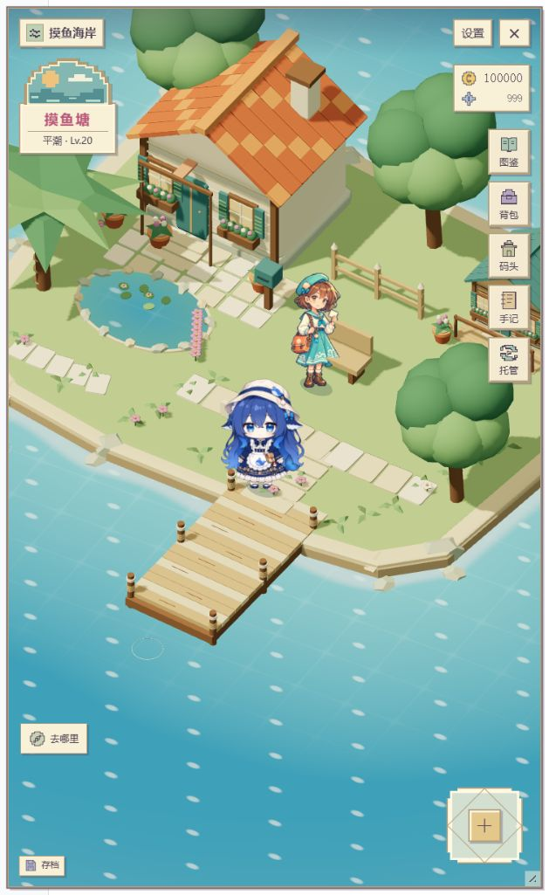
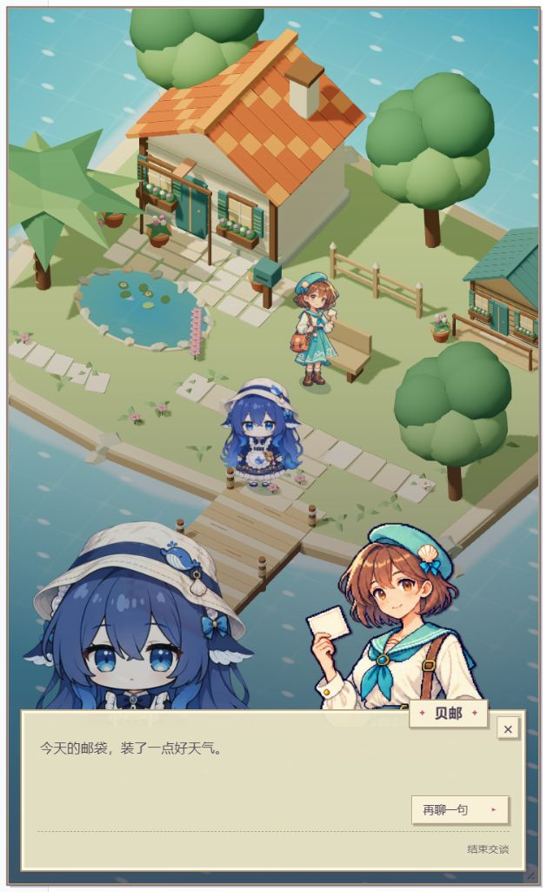

# dsh-fisher · 摸鱼海岸

[简体中文](README.md) | **English**

A relaxing fishing and collection plugin for DeepSeek Harness (DSH) Web. Head to the shore and cast a line, or enable automatic fishing and let your character wait for a catch while you use DSH.

**Current main branch: `main` · `0.3.0-preview.12`**. Explore four walkable 3D shores with detailed 2D characters and a pixel-art paper interface. You can build and install the plugin locally from source; it has not been published to npm.

The original pixel-art version, `0.1.0-rc.11`, is preserved in full on [archive/pixel-v1-rc11](https://github.com/Nath-Vikky/dsh-fisher/tree/archive/pixel-v1-rc11).

## Screenshots

<p>
  
  
</p>

Actual gameplay using demo progress. The scene fills the portrait window, with menus and conversations opening inside it.

## Features

- **Walk and fish on four shores**: Idle Pond (摸鱼塘), Meme Bay (热梗湾), Moonlight Pool (月光池), and Deep Sea (深潜海) each have distinct terrain and buildings, with two interactive fishing spots per shore. Move with the joystick, arrow keys / WASD, or navigation buttons.
- **Fish manually or alongside your work**: Cast, hook a catch, and manage line tension. Automatic fishing progresses with DSH activity; rarer catches take longer, and you can take over at any time.
- **Discover 49 collection entries**: 28 fish, 13 meme-inspired curiosities, 4 relics, and 4 visitors. The 37 living species have original, pearlescent, and stardust appearances, along with size records.
- **Upgrade gear and explore**: 14 pieces of fishing gear, 8 bait types, selectable tide phases, and shores unlocked through handbook levels and research progress. Basic dough bait is free and unlimited.
- **Meet visitors and complete requests**: 12 request types, 24 achievements, visitor invitations and stories, and two outfits per visitor. Conversations use original portraits on both sides, with the player and visitor taking turns speaking.
- **Display your collection**: An aquarium, a display shelf, 24 decorations, and seven catch-card styles. Export catch cards as local PNG files. The inventory supports categories, pagination, item locking, and bulk management.
- **Make the window your own**: Drag the floating launcher anywhere, resize or dock the game window, and retain its dimensions. Adjust the theme, text size, motion effects, rendering load, and sound.

Characters use shaded 2D images that convey depth and are occluded by objects in the 3D scene. Animations include standing, blinking, walking toward and away from the camera, casting, holding a rod, reeling, and reacting to a catch. The player turns to a back view when walking away from the camera.

## How to play

The game UI currently uses Chinese. The English instructions below include the Chinese button labels so you can find them in the game.

Aquariums, display shelves, and equipped decorations appear on all four 3D shores. Visitors walk, sit and observe your collection in either outfit, and head to the seat for a picnic. Approach facilities to inspect and arrange them using the bottom action button, or navigate there with “去哪里”. All 24 decorations have distinct geometry, and float movement and splashes reflect different fight patterns.

Each coast has distinct fishing spots and an independent story. Coral Bay, Moonlit Pool, and Deepwater Sea offer branching routes with persistent shore decorations. The automatic Clues goal follows the current story and waits when a choice or construction needs your attention.

Invite a discovered Sword-and-Shield Dog, Milk Frog, or Banana Cat from Shore Stories → Companions. They offer line protection, catch clues, or a shorter automatic wait, plus small shore interactions. Companions have walking, greeting, guarding or jumping frames. A cast keeps the companion it started with.

Open Shore Stories → “继续岸边生活” to track a stardust Gemfish, dedicate a letter or light to a built memorial, or invite a familiar visitor to a picnic. Tracking requires the specified shores, spots, and tides. Picnics consume one ordinary fish you explicitly choose and leave a memory in an album after the conversation. The automatic “追传说” goal waits whenever travel or preparation is needed.

### Manual fishing

1. Open “摸鱼海岸” from the floating launcher. Hold and drag an empty area of the scene to reveal a joystick and walk toward the water, or use “去哪里” (Where to?) above the save button at the bottom left to walk to a fishing spot automatically.
2. Near a fishing spot, select “在这里钓鱼” (Fish here) at the bottom center, then “抛竿” (Cast). At Idle Pond, the shallow cove favors ordinary fish, while the pier favors curiosities and old objects. Water cues and the preparation panel explain the difference.
3. When the float signals a bite, select “提竿” (Set the hook). Hold the reel button and release it when tension rises. Assisted line release is enabled by default; you can also use “点击切换收线” (Click to toggle reeling).
4. When the catch popup appears, click the empty area outside it or “留下并继续” (Keep and continue) to add the catch to your inventory. You can also sell, release, or recycle it. If the inventory is full, you must resolve the catch first.

Focus the scene before using the arrow keys / WASD. Manual fishing pauses when you close the game window, leave the page, or click outside the game. Select “继续这一竿” (Resume this cast) when you return.

### Automatic fishing

Open “托管” (Auto) on the right and turn on the prominent “自动钓鱼” (Automatic fishing) switch. Your character walks back to the selected fishing spot and uses your current bait and equipment. Fishing progresses with DSH model responses and tool activity. By default, catches go into your inventory or collection automatically, with a summary when you return. Use the goal cards to choose “随心钓” (Relax), “补图鉴” (Collection), “攒壳币” (Coins), or “找线索” (Clues). Collection favors undiscovered entries at the cost of longer waits. Coins sells eligible duplicate ordinary fish in their original appearance, preserving first discoveries, records, and special appearances. Clues waits for your input after a discovery. Goal changes apply to the next cast. Automatic fishing pauses if the inventory is full or bait runs out.

Select “接管这一竿” (Take over this cast) to switch to manual fishing while retaining the catch and progress already accumulated. Automatic fishing is off by default and is independent of work supplies. It can continue while the game window is closed, but no offline time is credited after you exit DSH or qualifying activity stops.

### DSH work supplies

Open “码头 → DSH 补给” (Dock → DSH supplies) and enable “工作补给” (Work supplies). DSH activity earns points toward supply packs. The page shows stored packs and progress toward the next one. Choose a bait tile and claim a pack for 20 shell coins, 1 tide shard, and 2 portions of that bait. Stored packs remain available when the switch is off; open “!” for timing rules and the daily limit.

### Shore stories and companions

Fish near the shallow cove at Idle Pond to find a message in a bottle. Follow it in “岸边故事” (Shore stories), talk to Beiyou, recover an old object, and contribute ordinary fish to build a wind chime that stays in the 3D scene. The story has no time limit.

After discovering Knife-and-Shield Dog (刀盾狗), invite it through “岸边故事 → 岸边伙伴” (Shore stories → Companions). It follows you and guards your line once per cast during a burst or dangerous tension. Companion changes apply to the next cast.

### Menus and visitors

| Menu | What it does |
| --- | --- |
| 图鉴 · Collection | View discoveries, appearances, size records, and clues |
| 背包 · Inventory | Inspect catches, lock items, sell, release, or organize them |
| 码头 · Dock | Change shores, bait, equipment, and tide phases; manage local saves |
| 手记 · Journal | Accept requests, view achievements, meet visitors, and arrange displays |
| 托管 · Auto | Choose a goal, enable automatic fishing, view summaries, or take over the current cast |
| 岸边故事 · Shore stories | Follow the Idle Pond story, prepare building materials, and invite a companion |
| 设置 · Settings | Adjust the window, theme, text size, motion, rendering load, and sound |

Approach a visitor and select “交谈” (Talk), or choose “聊一句” (Chat) from their journal page, to open a conversation with portraits on both sides. Use “再聊一句” (Chat more) and “继续” (Continue) to advance. Press Esc or select “结束交谈” (End conversation) to return. Casual chat does not consume items or change relationship progress.

The floating launcher normally shows Jingxi's (鲸汐) portrait with flowing water. During automatic fishing, it changes to a fishing rod over the water. Both launcher and window positions are remembered. The “摸鱼海岸” section in DSH Settings also provides a plugin enable/disable switch.

## Build and install

Currently targets **DSH Web `0.1.2-rc.1`**. The build environment uses **Node.js `22.20.0`** and **pnpm `11.19.0`**. The commands below are for Windows PowerShell. The 3D scene requires a browser with WebGL support; a lightweight view is available if it cannot load.

Clone the main branch and build a local package:

```powershell
git clone https://github.com/Nath-Vikky/dsh-fisher.git
cd dsh-fisher
pnpm install --frozen-lockfile --ignore-scripts
pnpm check
pnpm pack
```

Install and start a preview using a separate data directory:

```powershell
$env:DSH_HOME = Join-Path $PWD 'tmp/dsh-fisher-preview'
$fisherVersion = (Get-Content .\package.json -Raw | ConvertFrom-Json).version
$fisherPackage = Join-Path $PWD "nath-vikky-dsh-fisher-$fisherVersion.tgz"
pnpm dlx @deepseek-ai/dsh@0.1.2-rc.1 plugin --profile web add --ignore-scripts $fisherPackage
pnpm dlx @deepseek-ai/dsh@0.1.2-rc.1 web
```

Open the local URL printed in the terminal and click “摸鱼海岸” to play. Fishing itself does not require a model API key. Automatic fishing requires actual activity in DSH.

To update an existing installation, stop that DSH host, remove the old plugin using the same `DSH_HOME`, then install the newly built package and restart. Removing the plugin preserves saves by default.

```powershell
pnpm dlx @deepseek-ai/dsh@0.1.2-rc.1 plugin --profile web remove @nath-vikky/dsh-fisher
```

For development, you can also run:

```powershell
pnpm test
pnpm content:check
```

## Saves and privacy

Game progress and the plugin's enabled state are stored on the host under `$DSH_HOME/fishersave/`. If `DSH_HOME` is not set, they are stored in `.dsh/fishersave/` under your user directory. Window and launcher position preferences are stored in the current browser.

“码头 → 本机存档” (Dock → Local saves) provides export, import preview, backup recovery, and deletion. Confirming an import replaces the current progress and keeps a recovery copy of the previous save; automatic fishing and work supplies are reset to off. Deletion requires typing the exact phrase `删除摸鱼海岸` and only removes this plugin's game data and backups.

Upgrading an older save preserves the original file and retains collected items, balances, and records. Exporting a copy before updating is recommended. If saving fails, the game pauses and prompts you to retry. A sudden power loss may roll back the most recent unsaved actions.

**The plugin makes no additional model requests and does not read chat content, reasoning content, tool arguments, or token counts.** Automatic fishing and work supplies use only DSH activity metadata. There are no in-app purchases, player trading, multiplayer features, or leaderboards.

Newer saves cannot be opened directly by an older branch. Use a backup from before the upgrade when rolling back.

## Performance and compatibility

The game and 3D code load on demand, with compressed delivery and versioned caching. Character animations are decoded ahead of time and textures are uploaded in batches. The scene appears after the first frame is ready. Decoded images can be reused when switching shores or briefly closing the window, and the current visitor's original portrait is prepared in advance.

Rendering is capped at 30 FPS by default. The “降低动画与画布开销” (Reduce animation and rendering load) setting lowers the cap to 20 FPS, reduces rendering resolution, and disables real-time shadows. Rendering pauses when the page is hidden, loses focus, or a detail view is open. Leaving the scene releases GPU resources, and unused decoded-image caches are released automatically.

This is a preview version; actual performance depends on your device and DSH workload. The game window is an overlay inside the DSH webpage. If WebGL is unavailable, you can retry or use the lightweight pixel-art view. Compatibility with other DSH versions and platforms has not yet been verified.

## License

The project code and generated artwork are currently `UNLICENSED`; no redistribution license has been granted. Three.js is licensed under MIT; see the [Three.js license](assets/licenses/three-LICENSE.txt). This is an independent plugin.
