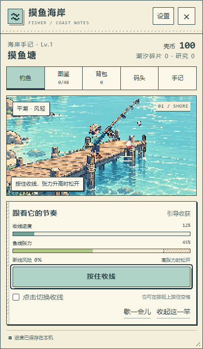

# dsh-fisher · 摸鱼海岸

面向 DeepSeek Harness（DSH）Web 的像素钓鱼与收藏插件。工作之余，在岸边慢慢钓一竿。

当前版本为 `0.1.0-rc.6`，可从源码构建并本地安装，尚未发布到 npm。



## 功能

- 四个钓点及各自场景、49 个图鉴条目：28 种鱼、13 种奇珍异兽、4 件遗物和 4 位来客。37 种生物具有原色、珠光、星砂外观及尺寸纪录。
- 抛竿、等待咬钩、提竿和张力控制，支持辅助松线、按住收线或点击切换收线。
- 14 件鱼具、8 类鱼饵、潮相选择，以及按手册等级与研究进度解锁的地区。
- 收获可留下、出售、放流或回收；图鉴保留发现与纪录。批量处理保留新发现、首次外观、纪录、锁定和展示中的个体。
- 三个委托槽、12 种委托、24 项成就，以及来客邀请、相遇故事和两套衣装。
- 鱼缸展示八个生物，陈列架展示六件奇物或遗物；24 件装饰与七种收获卡样式。收获卡可保存为本地 PNG。
- 工作补给默认关闭。启用后，仅观察 DSH 新活动的回合边界和事件到达，获得可保留的额外补给。
- 像素场景与细墨线漫画界面，支持浅深主题、字号、减少动态、低性能设置及默认关闭的轻声提示。
- 可自由拖动入口按钮；窗口支持拖动、缩放、停靠、尺寸预设、宽高输入、比例锁定和位置恢复。
- DSH 设置中的“摸鱼海岸”分栏提供启停开关；停用会暂停游戏与工作补给，并保留进度。
- 宿主保存进度；提供存档导出、预览后导入、备份恢复与输入名称后删除。

## 玩法

点击“摸鱼海岸”入口，再点击“抛竿”。入口默认在页面右下角，可拖动到页面中的任意位置，聚焦后也可用方向键微调；位置会保留。浮漂提示咬钩后点击“提竿”，按住收线按钮或在按钮上按住空格收线，张力升高时松开；也可启用“点击切换收线”。辅助松线默认开启，可在抛竿前关闭。

获得收获后显示弹窗，点击空白处或“留下并继续”会放入背包；背包已满时需选择出售或放流／回收。领取补给、委托奖励及购买物品后也会显示获得弹窗。

关闭窗口、离开页面或点击游戏外部会暂停这一竿。返回后点击“继续这一竿”；在其他浏览器窗口选择“在这里继续这一竿”会转移操作权。游戏不在后台自动钓鱼。

“码头”和“手记”以入口卡片组织功能，点击后在游戏窗口内打开详情。详情与获得弹窗随游戏窗口居中和缩放；图鉴、背包和较长列表使用分页。“!”按钮可悬浮、聚焦或点击查看说明。

“码头”提供钓点、鱼饵、装备、潮相和存档管理。普通面团免费无限，基础游玩不依赖工作补给。工作补给只观察启用后的新活动，多个会话合并计时，离线不累计；关闭小游戏仍可积累，关闭补给开关或禁用插件则停止观察。

“手记”中的委托在接下后记录新进度。交付订单可使用已有库存，需选定具体个体；展示中的收藏须先取回。完成来客的永久请求可获得邀请，认识后可免费重访，后续请求解锁故事和衣装。

## 存档与隐私

游戏不调用模型，不读取聊天正文、工具参数或 Token 数量，钓鱼无需模型 API Key。没有充值、交易或排行榜。

窗口与入口位置偏好保存在当前浏览器。游戏进度和插件启停状态保存在宿主 `$DSH_HOME/fishersave/`；未设置 `DSH_HOME` 时位于用户目录的 `.dsh/fishersave/`，独立于 Codekin。

进行中的竿通常每两秒保存，暂停时也会保存。保存失败会暂停操作并提示重试；突然断电可能回退最后一段尚未保存的操作。刷新或重启不会重新抽选已确定的收获。卸载默认保留存档。

导入会先显示文件预览，确认后替换当前进度，并保留替换前的恢复文件。进行中的竿保留收获和随机状态、暂停等待继续；工作补给恢复为关闭。损坏或不兼容的原文件会保留，界面提供导出与恢复操作。删除需要输入“删除摸鱼海岸”，只清理本插件的游戏数据及其备份。

旧预览存档首次升级前会保存原文件；已有个体、余额和纪录继续有效。升级后的存档需要本版或兼容的后续版本，建议在更新前导出一份。

## 构建与安装

开发基线：Windows、Node.js `22.20.0`、pnpm `11.19.0`、DSH Web `0.1.2-rc.1`、Microsoft Edge。其他宿主版本和平台尚未验证。

在项目目录执行：

```powershell
pnpm install --frozen-lockfile --ignore-scripts
pnpm check
pnpm test
pnpm content:check
npm pack --ignore-scripts
```

使用独立的本地目录安装并启动：

```powershell
$env:DSH_HOME = Join-Path $PWD 'tmp/dsh-fisher-preview'
$fisherPackage = Join-Path $PWD 'nath-vikky-dsh-fisher-0.1.0-rc.6.tgz'
pnpm dlx @deepseek-ai/dsh@0.1.2-rc.1 plugin --profile web add --ignore-scripts $fisherPackage
pnpm dlx @deepseek-ai/dsh@0.1.2-rc.1 web
```

打开终端提供的本地地址，点击“摸鱼海岸”，等待连接后即可游玩。更换本地包时，先停止该宿主、移除旧插件，再安装新包并重启；存档会保留。

```powershell
pnpm dlx @deepseek-ai/dsh@0.1.2-rc.1 plugin --profile web remove @nath-vikky/dsh-fisher
```

## 已知边界

窗口是 DSH 页面中的浮层，不是操作系统置顶窗口。禁用宿主插件后，已打开的页面会停止游戏画面并显示连接提示；重新启用后点击“重新连接”，或重新打开页面。

本地单机存档不提供强防作弊。真实工作中的长时间性能、浏览器后台切换及手感仍需结合使用者的机器体验判断。不包含联机、Live2D 或模型生成台词。

代码及生成美术目前随项目以 `UNLICENSED` 状态维护；尚未授予对外再分发许可。本项目为独立插件。

项目地址：[Nath-Vikky/dsh-fisher](https://github.com/Nath-Vikky/dsh-fisher)。
